# Kitchen Configurator Pro — Class Diagram

## Core Architecture Class Diagram

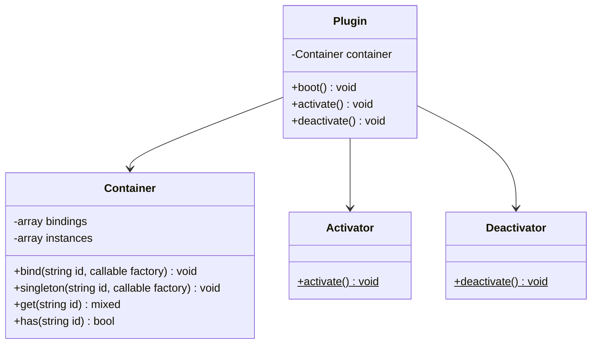

---

## Admin CRUD Layer (Phase 3 — Implemented)

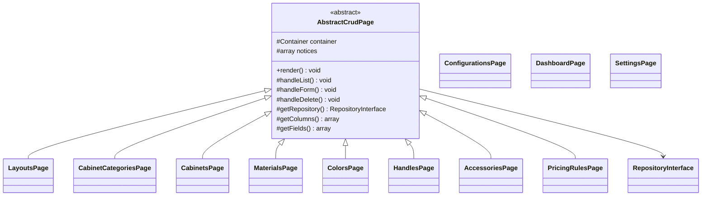

---

## Service Provider Pattern

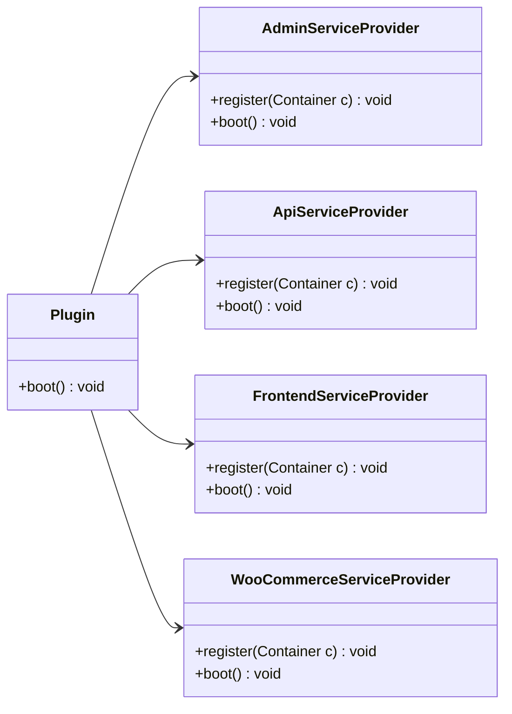

---

## Repository Layer

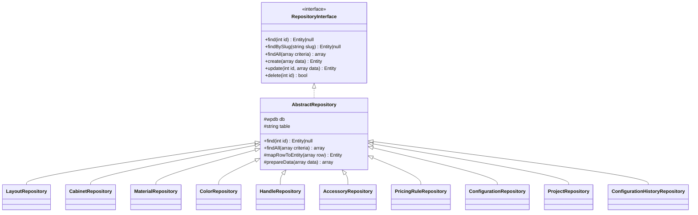

---

## Domain Entities

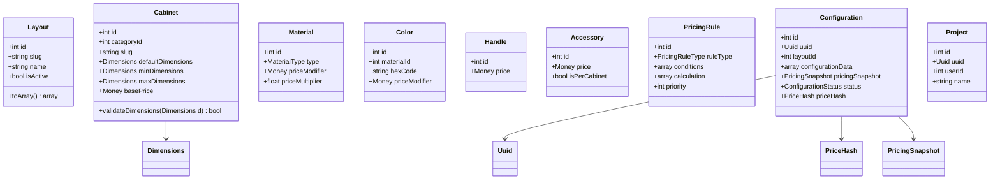

---

## Value Objects

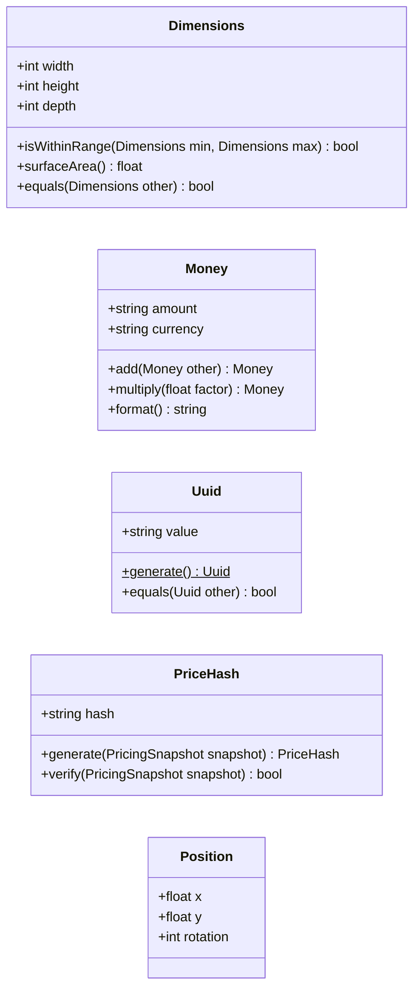

---

## Service Layer

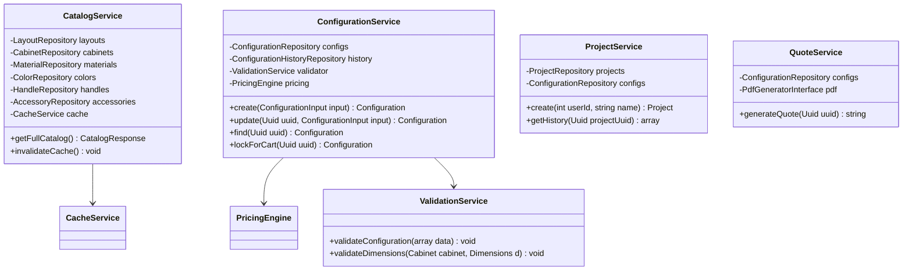

---

## Pricing Engine

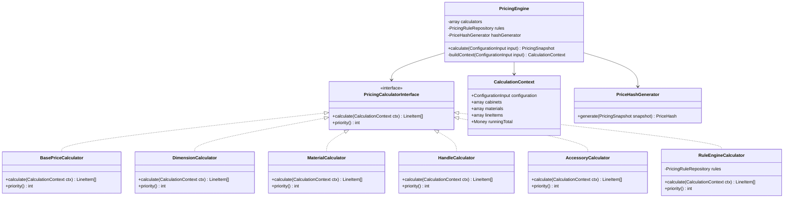

---

## REST API Layer

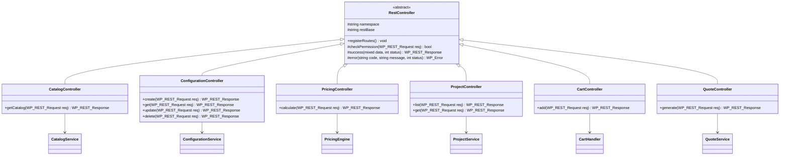

---

## WooCommerce Integration

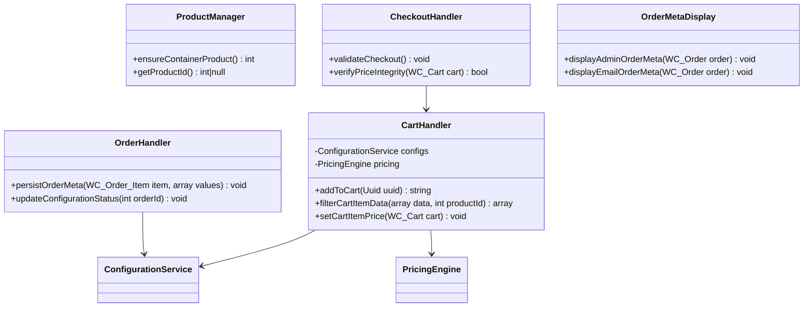

---

## Database Migration System

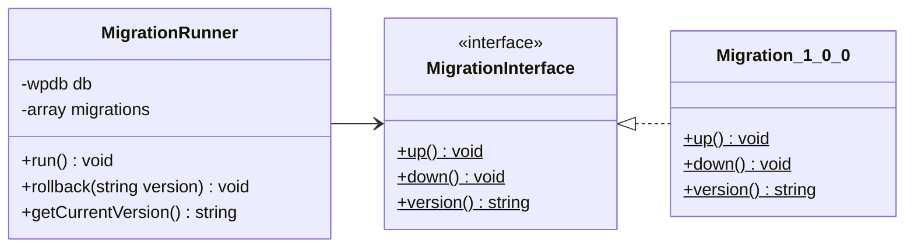

---

## DTOs and Enums

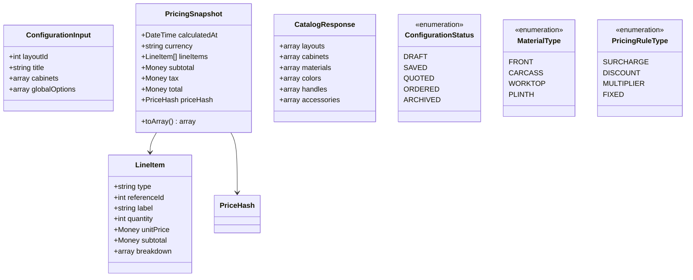

---

## Dependency Flow (SOLID)

```mermaid
flowchart TB
    subgraph Presentation
        API[REST Controllers]
        ADMIN[Admin Pages]
        FE[Frontend Shortcode]
    end

    subgraph Application
        SVC[Services]
        PE[PricingEngine]
    end

    subgraph Domain
        ENT[Entities / DTOs / VOs]
        CTR[Contracts / Interfaces]
    end

    subgraph Infrastructure
        REPO[Repositories]
        WC[WooCommerce Handlers]
        DB[(MySQL)]
    end

    API --> SVC
    ADMIN --> SVC
    FE --> API

    SVC --> CTR
    SVC --> ENT
    PE --> CTR

    REPO ..|> CTR
    REPO --> DB
    WC --> SVC
    SVC --> REPO
```

**SOLID mapping:**

| Principle | Implementation |
|-----------|----------------|
| **S** — Single Responsibility | Each calculator handles one price aspect; repositories only persist |
| **O** — Open/Closed | New calculators implement `PricingCalculatorInterface` without modifying engine |
| **L** — Liskov Substitution | All repositories honor `RepositoryInterface` |
| **I** — Interface Segregation | Separate interfaces: Repository, PricingCalculator, Migration, PdfGenerator |
| **D** — Dependency Inversion | Services depend on interfaces; container wires concrete implementations |

---

## REST API Endpoint Map (Reference for Phase 5)

| Method | Endpoint | Controller | Service |
|--------|----------|------------|---------|
| GET | `/kcp/v1/catalog` | CatalogController | CatalogService |
| POST | `/kcp/v1/configurations` | ConfigurationController | ConfigurationService |
| GET | `/kcp/v1/configurations/{uuid}` | ConfigurationController | ConfigurationService |
| PUT | `/kcp/v1/configurations/{uuid}` | ConfigurationController | ConfigurationService |
| DELETE | `/kcp/v1/configurations/{uuid}` | ConfigurationController | ConfigurationService |
| POST | `/kcp/v1/pricing/calculate` | PricingController | PricingEngine |
| GET | `/kcp/v1/projects` | ProjectController | ProjectService |
| GET | `/kcp/v1/projects/{uuid}` | ProjectController | ProjectService |
| POST | `/kcp/v1/cart/add` | CartController | CartHandler |
| POST | `/kcp/v1/quotes/{uuid}` | QuoteController | QuoteService |

---

*End of Class Diagram Document*
