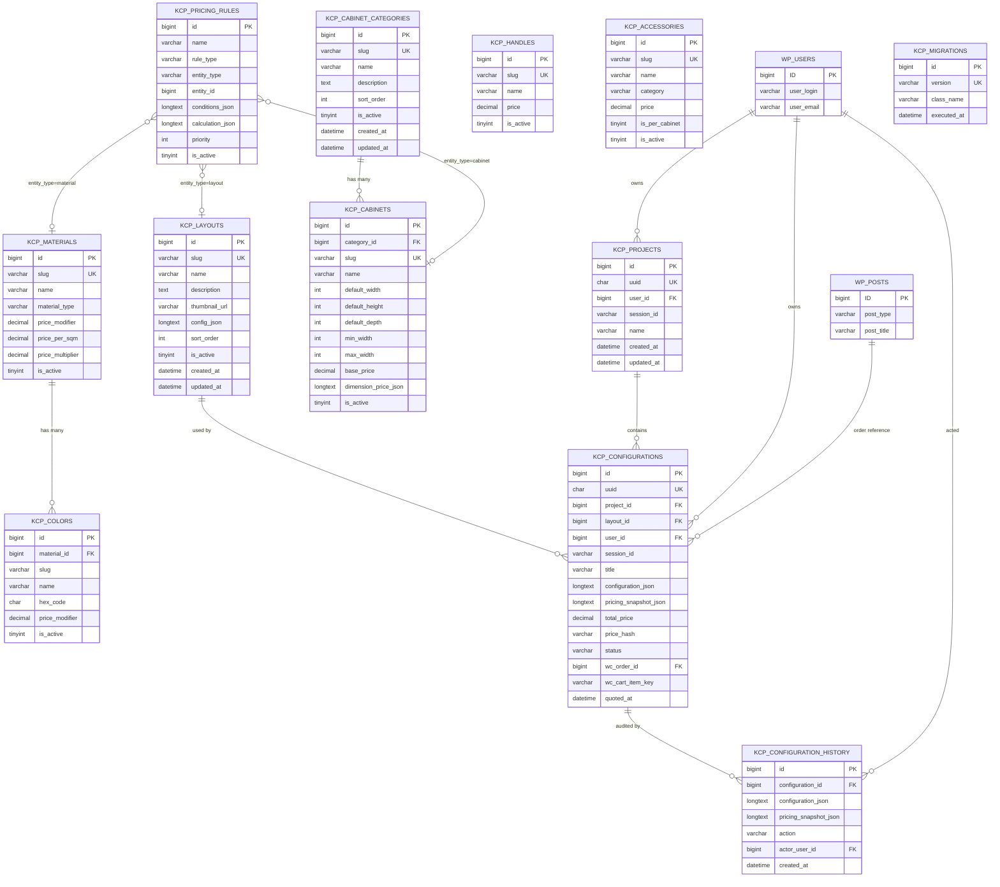
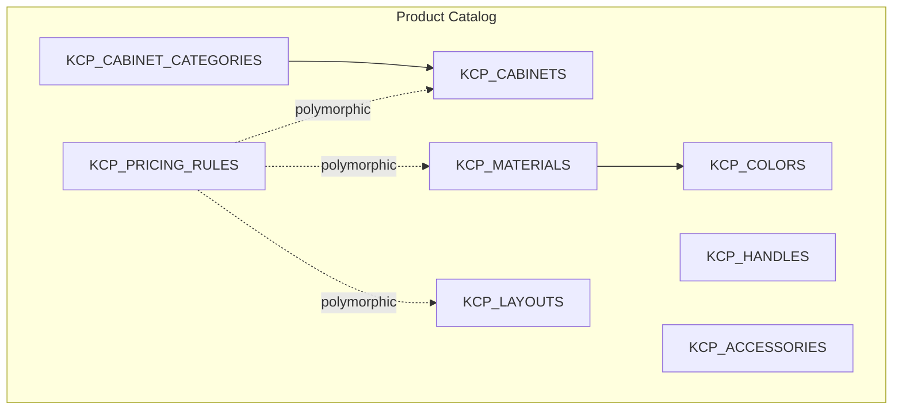
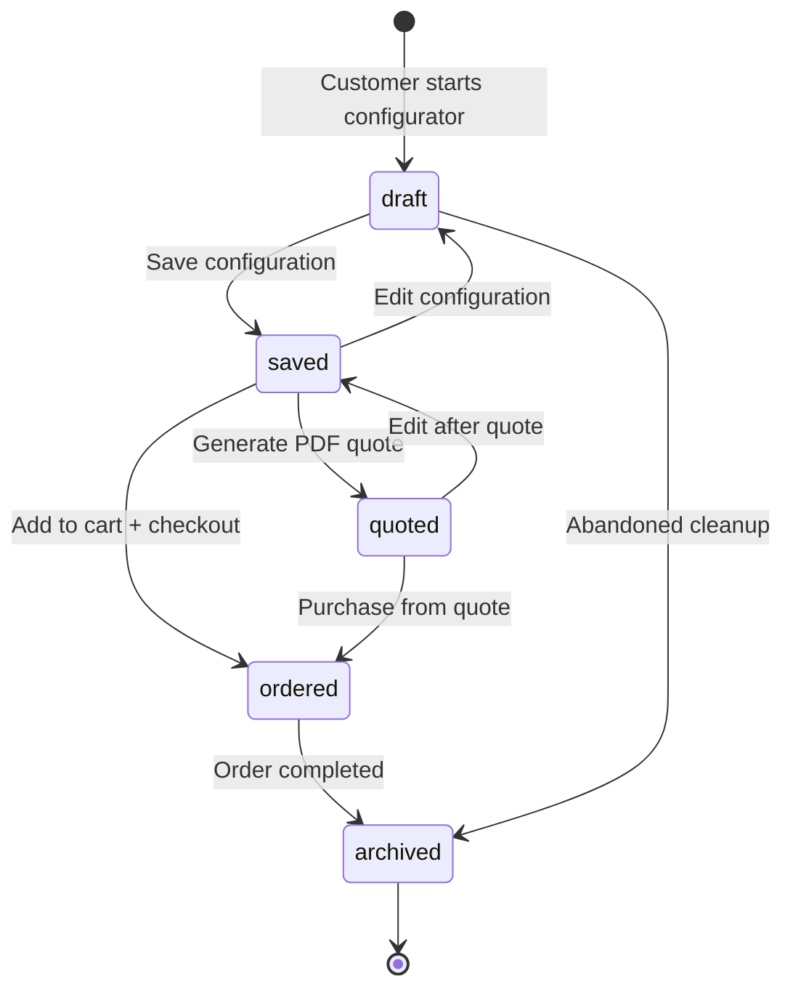
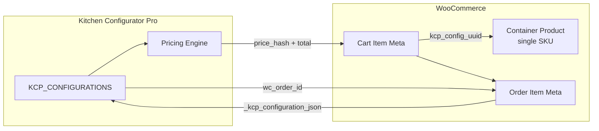
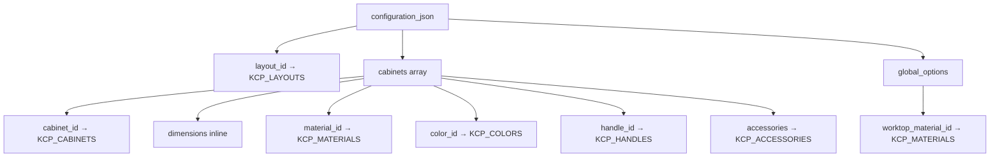

# Kitchen Configurator Pro — Entity Relationship Diagram

## Mermaid ER Diagram

---

## Simplified Catalog Diagram

---

## Configuration Lifecycle Diagram

---

## WooCommerce Integration Diagram

---

## JSON Reference Model (Logical, not stored as tables)

Configuration JSON references catalog entities by ID — no FK at JSON level:

---

## Table Count Summary

| Category | Tables | Purpose |
|----------|--------|---------|
| System | 1 | Migration tracking |
| Catalog | 7 | Layouts, cabinets, materials, colors, handles, accessories, rules |
| Customer data | 3 | Projects, configurations, history |
| **Total custom** | **11** | |
| WordPress native | 2+ | wp_users, wp_posts (WC orders/products) |
| WooCommerce meta | — | Order item meta for config snapshots |

---

*End of ER Diagram Document*
